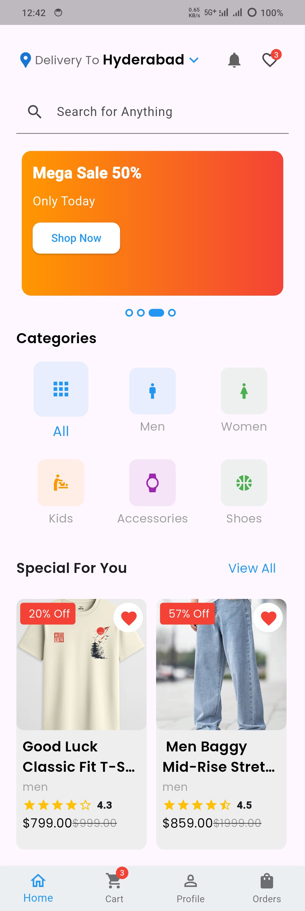
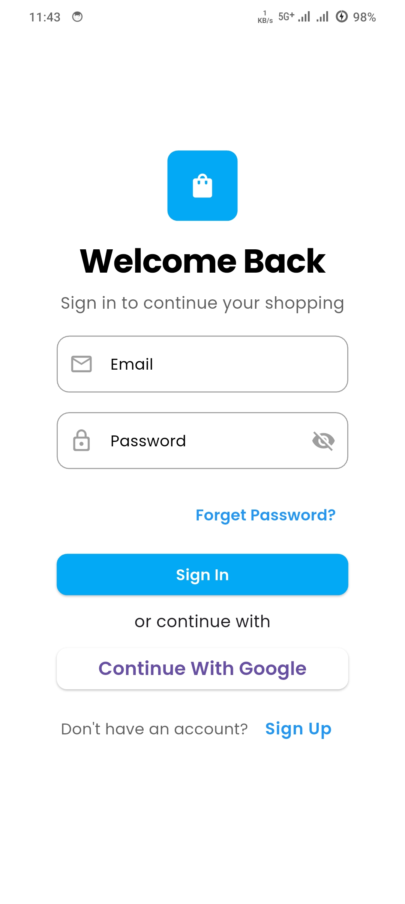
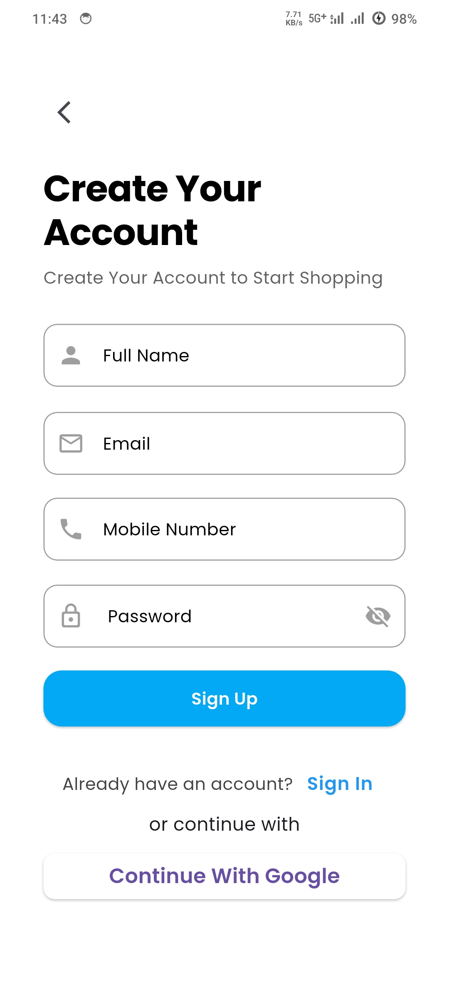
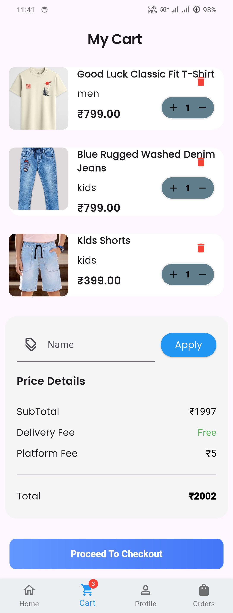
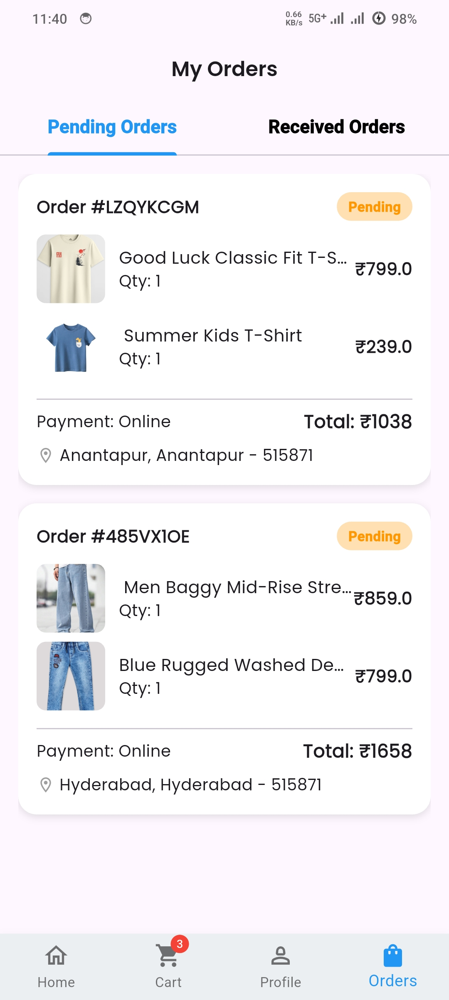
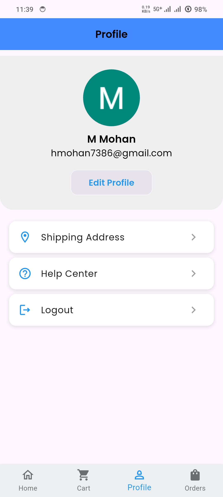
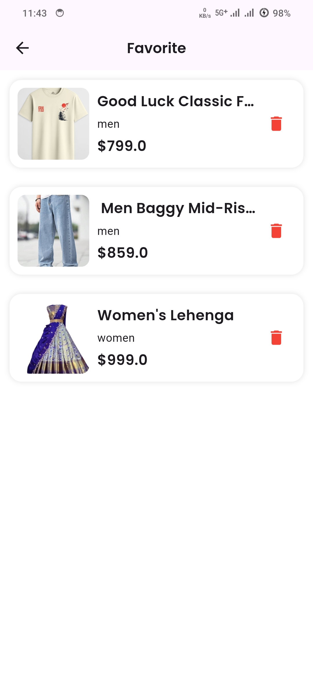

# 🛍 Ecommerce App

A modern Flutter Ecommerce application with Firebase backend.

## ✨ Features
- 🔐 Firebase Authentication (Email/Password)
- 🔑 Google Sign-In
- 🛒 Cart Management (Firebase synced)
- ❤️ Favorites (Firebase synced)
- 📦 Order Management (Pending & Received)
- 👤 Profile Update & Password Change
- 🏠 Home Screen with Banner Slider
- 📂 Category Filter
- ⭐ Product Ratings & Reviews
- 📱 Responsive UI (Mobile & Desktop)

## 🛠 Tech Stack
- **Flutter** - UI Framework
- **Firebase Auth** - Authentication
- **Cloud Firestore** - Database
- **Firebase Storage** - Image Storage
- **Provider** - State Management
- **Google Sign In** - Social Login

## 📦 Dependencies
```yaml
firebase_core: ^4.7.0
cloud_firestore: ^6.3.0
firebase_auth: ^6.4.0
firebase_storage: ^13.3.0
google_sign_in: ^6.2.1
provider: ^6.1.5+1
carousel_slider: ^5.1.2
image_picker: ^1.1.2
```

## 🚀 Getting Started

1. Clone the repo
```bash
git clone https://github.com/Mohan7386/ecommerceapp.git
```

2. Install dependencies
```bash
flutter pub get
```

3. Setup Firebase
   - Create Firebase project
   - Add `google-services.json` to `android/app/`
   - Run `flutterfire configure`

4. Run the app
```bash
flutter run
```

## 👨‍💻 Author
**Mohan** - [GitHub](https://github.com/Mohan7386)

## 📸 Screenshots
<p float="left">
  
  
  
  
  
  
  
</p>
